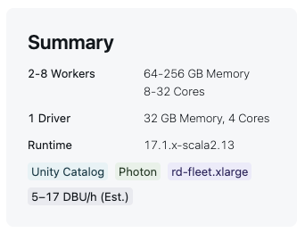

# kingfisher_wells

### Do the Latitude/Longitude locations for the same oil wells match among vendors in Kingfisher County Oklahoma?

## **_Mostly!_**

The surface location for wells present from all three sources (
[S&amp;P Global](https://www.spglobal.com/commodity-insights/en/products-solutions/upstream-midstream-oil-gas),
[Enverus](https://www.enverus.com/products/enverus-core/),
and [Oklahoma Corporation Commission](https://gisdata-occokc.opendata.arcgis.com/)
) as of July 2025 are mapped using a simple [streamlit](https://streamlit.io/) app.

## Spoiler alert: about 250 (~3%) of the surface Lat/Lon points are "misplaced" by over 500 meters relative to each other.

Most of this exercise was to learn and document my adventures with Databricks Asset Bundles and CI/CD workflows. Things are moving fast at Databricks, and there's a lot of out-of-date documentation out there.

The Medallion-based process:

1. **BRONZE**

Start by downloading data as .csv from Enverus and OCC via their web APIs, writing files directly to an S3 "External Location" managed by Unity Catalog. I also uploaded a .csv from S&P since I don't have API credentials. In all three cases, I filtered simply by `county = 'KINGFISHER'`. Each .csv was loaded into its own Delta table in the `geodata.bronze` schema.

2. **SILVER**

I selected identity columns (UWI, County, Well Name) and surface Latitude/Longitude from each source table. S&P uses the NAD27 datum, so I transformed Lat/Lon fields to WGS84 to match other sources. I did not try to normalize/clean Lat/Lon, since I want to examine this spatially, as-is. These standardized tables were written to the `geodata.silver` schema.

3. **GOLD**

I composed a single dataframe from a union of `silver` tables and pivoted on the standardized ID to make a "wide" format to compare distance (via `ST_DISTANCESPHERIOD`) between all pairs of POINTs in a single row. I only want to compare "triplets" so I filtered out NULL geometries. The final table: `geodata.gold.well_surface_locations` contains about 8300 rows.

---

### streamlit app

The default threshold (500m) limits the display to only wells where the location of any vendor disagrees with that of either of the other vendors by more than 500 meters.

This wasn't a data cleaning exercise, but it is easy to find a few wells where the County or Longitude quadrant sign is wrong. At lower thresholds
we can see many expected cases where the WGS84 position is farther north and east than the NAD27 point. However, a significant number exhibit variance beyond a datum shift, suggesting real quality issues.

In no particular order, here are some tips about this process that are valid as of August 2025:

- I briefly experimented with Mosaic and Sedona. Sedona required non-trivial init scripts for the compute cluster; Mosaic was supported only for surprisingly older versions of Spark and Photon (13.x). I instead opted for DBR 17.1-beta, which natively supported spatial.

- Using 17.1-beta exceeded the supported versions of databricks-connect, which meant I could not take advantage of vscode integration. 😑

- Performance on the compute cluster was surprisingly bad. We are dealing with fewer than 30K rows with the simplest of all POINT geometries. The ideal scenario (duckdb + local parquet) is quite snappy. I'll investigate performance improvements later. 

- Normal workflows would leverage the lower costs of a serverless SQL Warehouse to access the Delta table. However, SQL Warehouse (neither pro nor legacy) did not spatial functions, so I had to attach the bundled app to my 17.1-beta cluster. Ouch.
